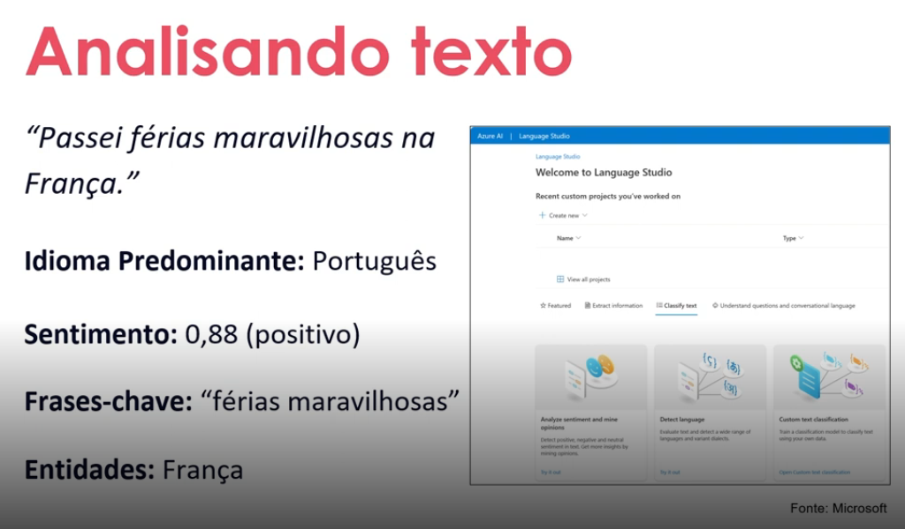
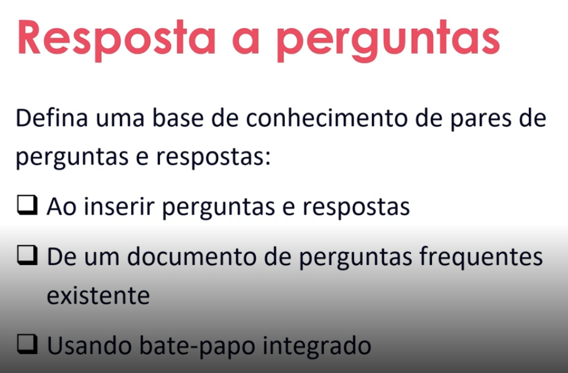
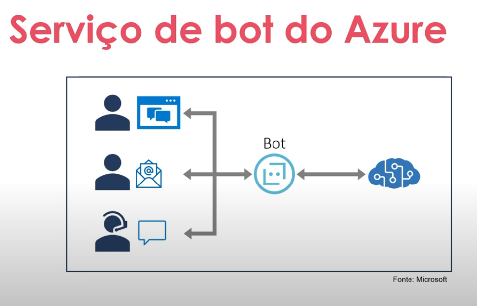
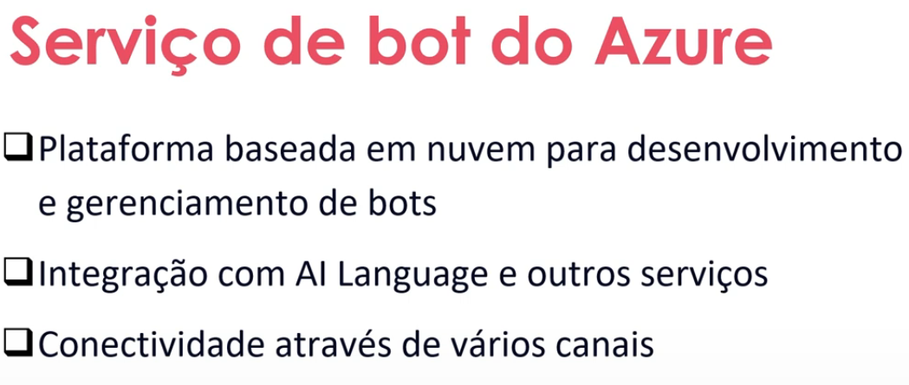
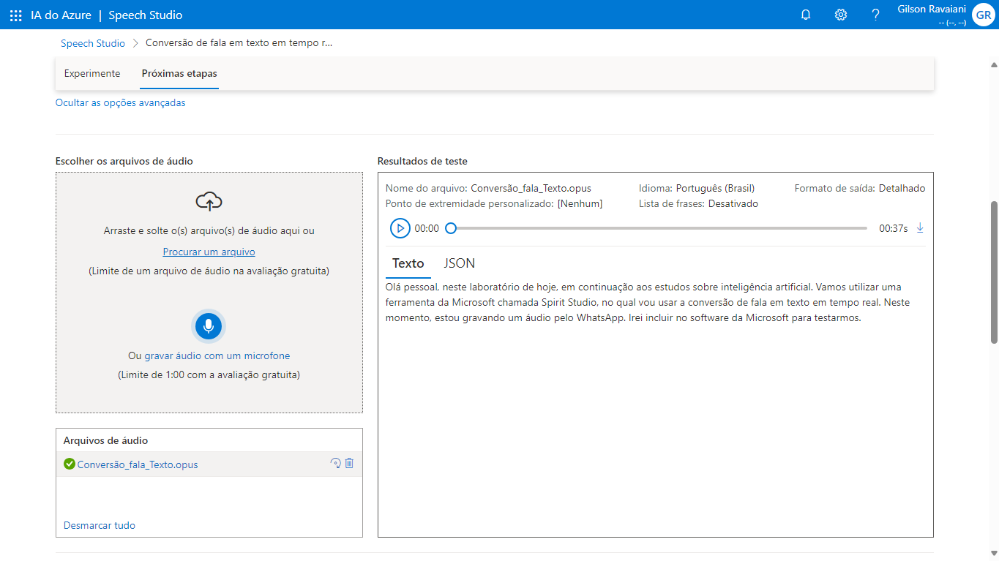

#  Análise de Sentimentos Language Studio no Azure AI

## Análise de texto e resposta a perguntas

A análise de texto e a resposta a perguntas são áreas específicas dentro da inteligência artificial que se concentram em compreender e responder a perguntas baseadas em texto. Isso envolve técnicas como processamento de linguagem natural (PLN) e aprendizado de máquina para extrair informações significativas de textos e fornecer respostas relevantes a perguntas feitas em linguagem natural. Essas tecnologias são amplamente utilizadas em assistentes virtuais, sistemas de busca na web, sistemas de atendimento ao cliente e muito mais.

## Serviço de bot do Azure

O serviço de bot do Azure é uma plataforma na nuvem oferecida pela Microsoft que permite aos desenvolvedores criar, implantar e gerenciar bots de conversação. Ele fornece uma variedade de ferramentas e serviços para facilitar o desenvolvimento de bots inteligentes que podem interagir com os usuários de forma natural, seja por texto, voz ou ambos. O serviço de bot do Azure integra-se com outros serviços da Microsoft, como o Azure Cognitive Services, que oferece recursos avançados de processamento de linguagem natural, reconhecimento de fala e análise de texto, ajudando os desenvolvedores a criar bots mais sofisticados e eficazes.

**# Chat** 
**# Email** 
**# Ligação**

## Compreensão da linguagem coloquial

A compreensão de linguagem coloquial em IA refere-se à capacidade de um sistema de inteligência artificial entender e interpretar a linguagem usada em conversas informais ou cotidianas entre pessoas. Isso inclui gírias, expressões idiomáticas, abreviações, erros gramaticais comuns e outros elementos que são característicos da linguagem falada e escrita informal.

Para alcançar essa capacidade, os sistemas de IA geralmente empregam técnicas de processamento de linguagem natural (PLN) que são projetadas para lidar com a variabilidade e a ambiguidade da linguagem humana. Isso inclui o uso de algoritmos de aprendizado de máquina para analisar grandes quantidades de dados de texto e identificar padrões que ajudem a entender o significado subjacente das expressões coloquiais.

Embora os sistemas de IA tenham avançado significativamente na compreensão da linguagem coloquial, ainda existem desafios a serem superados, especialmente em contextos culturais e linguísticos específicos. No entanto, com o avanço da tecnologia e o desenvolvimento de novas abordagens, a capacidade de compreensão de linguagem coloquial em IA está continuamente melhorando.

